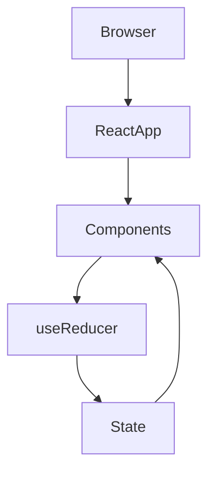
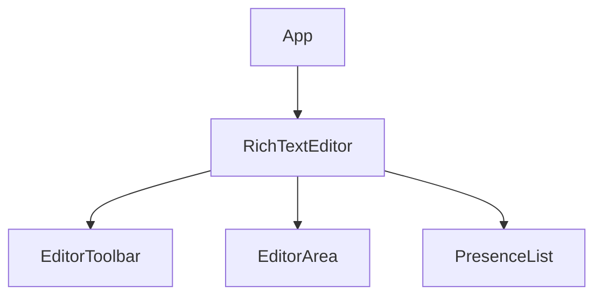
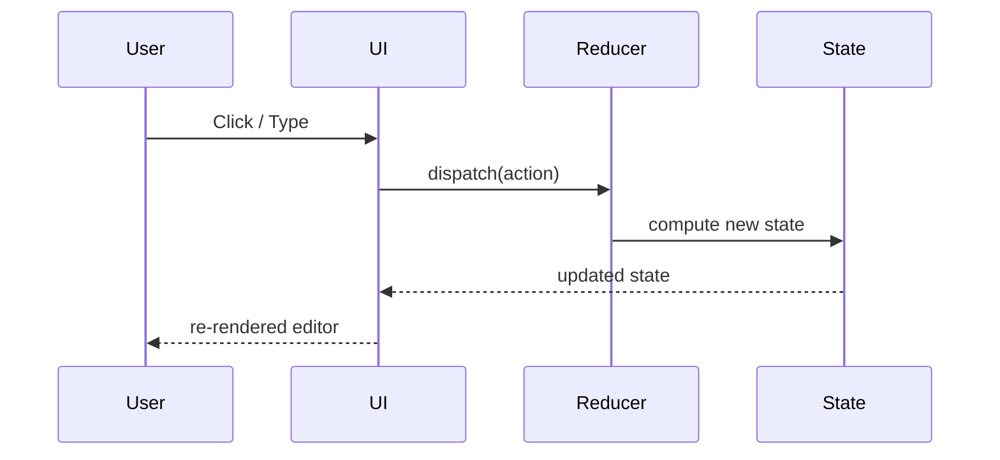
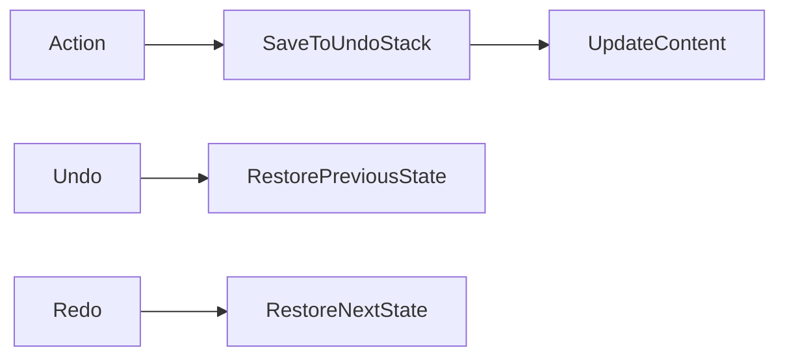
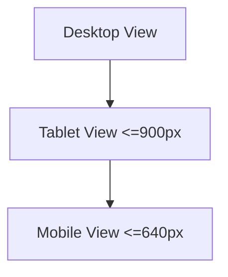
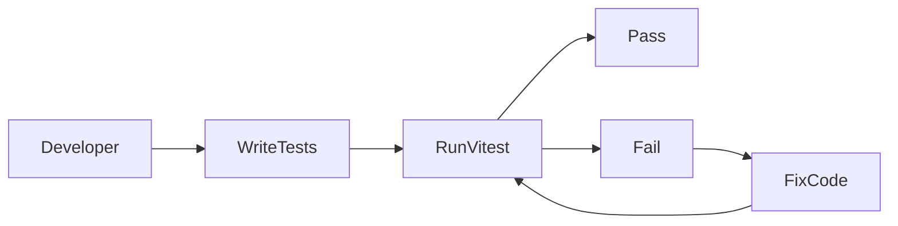
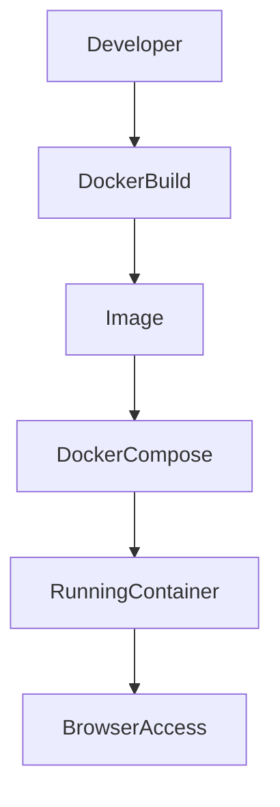

# Rich Text Editor

A production-ready, accessible, and fully tested **Rich Text Editor** built with React and Vite.  
This project demonstrates modern frontend architecture, centralized state management, accessibility compliance, responsive UI design, automated testing, and containerized deployment.

---

## Overview

This application provides a structured rich text editing experience with formatting controls, undo/redo history, and simulated multi-user presence.

The project emphasizes:

- Clean component architecture
- Predictable state management using `useReducer`
- Accessibility best practices
- Responsive UI design
- Automated testing
- Docker-based deployment

---

# System Architecture

## 1️⃣ High-Level Architecture



---

## 2️⃣ Component Hierarchy



---

## 3️⃣ State Management Flow



---

## 4️⃣ Undo/Redo Logic Flow



---

## 5️⃣ Responsive Design Strategy



Responsive adjustments include:
- Container width scaling
- Toolbar spacing adjustments
- Compact buttons on mobile
- Adjusted editor padding

---

## 6️⃣ Testing Workflow



---

## 7️⃣ Docker Deployment Flow



---

# Features

## Editing Capabilities
- Bold
- Italic
- Underline
- H1 / H2 / H3
- Undo / Redo
- Placeholder
- contentEditable support

## Multi-User Simulation
- Current User
- Other User 1
- Other User 2

## Accessibility
- role="textbox"
- aria-multiline="true"
- aria-label for buttons
- type="button" on all toolbar buttons
- Keyboard accessible
- Focus indicators

## Responsive Design
- Desktop optimized
- Tablet adaptive layout
- Mobile compact UI

## Testing
- Unit tests for reducer
- Integration tests for components
- Accessibility checks
- All tests pass

## Containerization
- Dockerfile
- docker-compose.yml
- One-command deployment

---

# Project Structure

```
rich-text-editor/
│
├── src/
│   ├── components/
│   ├── hooks/
│   ├── styles/
│   ├── tests/
│
├── public/
├── Dockerfile
├── docker-compose.yml
├── package.json
├── vite.config.js
└── README.md
```

---

# Installation

## Local Setup

```bash
npm install
npm run dev
```

App runs at:

```
http://localhost:5173
```

---

## Run Tests

```bash
npm test
```

All tests must pass.

---

## Docker Setup

```bash
docker-compose up --build
```

Stop:

```bash
docker-compose down
```

---

# Manual Verification Checklist

- [ ] Typing works
- [ ] Bold works
- [ ] Italic works
- [ ] Underline works
- [ ] H1/H2/H3 works
- [ ] Undo works
- [ ] Redo works
- [ ] Placeholder visible
- [ ] Accessibility attributes present
- [ ] Keyboard navigation works
- [ ] Responsive layout verified
- [ ] Multi-user presence visible
- [ ] No console errors
- [ ] Tests pass
- [ ] Docker builds successfully

---

# Tech Stack

| Technology | Purpose |
|------------|----------|
| React | UI Framework |
| Vite | Build tool |
| useReducer | State management |
| Vitest | Testing |
| React Testing Library | UI testing |
| CSS Modules | Scoped styling |
| Docker | Containerization |

---

# Project Status

Production-ready  
Fully tested  
Accessible  
Responsive  
Dockerized  
Documentation complete  

---

# License

Developed for educational and evaluation purposes.